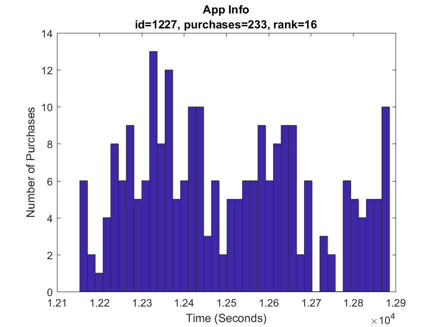

# anomaly-detection-for-marketplaces
A project for addressing anomaly detection practices in Matlab for marketplace platforms.

# Section 1- Review of the problem and data
## 1-1- Problem definition
The goal is to find goods whose purchase shows suspicious behavior. From a data analysis perspective, Suspicious behavior is any behavior that conflicts with the behavior of others and the majority of goods. From an operational and intuitive point of view, suspicious behavior is a behavior that some people use to raise the ranking of goods in different stores. This product can be a physical product or an application in markets such as Google Play or App Store. For example, creating abnormal downloads, making irregular purchase orders in bursts or with continuous patterns, etc., can be signs of anomalies.
Various information is usually available to find suspicious behavior in the web and mobile domains. For example, IP address, type of platform used, time, etc., can be factors recorded in the log and used as valuable features. Here, only the product or app ID and purchase times are available, and the issue should be analyzed and resolved accordingly.

## 1-2- Dataset
The data set provided is a CSV file that contains two columns. The first column contains the ID for each product or application, and in the second column is the time of the "purchase." The time here is recorded as Timestamp and the time quantum in the system in seconds. The file contains 301401 entries, each inserted in a row.

## 1-3- The first attempt
To better understand the data, we first calculate statistics from the status of the data we have. The first point is that here in the data set, the data is sorted by the ID of each app, not by time. The time format used here is the Timestamp format used in Unix, and the timezone is set to Iran's, from 9/6/1974, 12:00:00 AM to 4/6/1975, 10:59:00 PM. It is approximately 212 days.
 
Therefore, the period discussed for applications is approximately 212 (approximately 213) days. Now let's look at the number of apps in the data set and their status. There are a total of 99,340 apps in the dataset. The statistics related to the number of purchases are as follows:
1. Minimum number of purchases: 1
2. Maximum number of purchases: 721
3. The average number of purchases is: 3.0340
4. The variance of the purchase number is: 77.9909

Based on these statistics and their frequency, there are some interesting points. For example, we have 55,143 apps that have only been ordered once! Approximately 83.9% of apps have lower than average purchases. In other words, given that the average number of orders here is 3,034, an enormous volume of apps have only been ordered 1 to 3 times. Apps that are so unpopular do not seem to be of much help in reaching a model for detecting suspicious apps. Apps with this small number of orders are probably just commissioned by the developer.
Here, to get a more accurate model, we exclude the apps with one purchase from the data set so that the behavior of the other apps can be better considered. To better understand the subject, we include the top apps that have more purchases in our considerations. For example, in Figure 1., the top 20 apps are considered, and their purchase histogram chart is drawn based on the time.

  Figure.1 20-app histogram has the most orders in time (seconds). 

|    |      |     |
| :---         |     :---:      |          ---: |
|    |      |     |
|    |      |     |
|    |      |     |
|    |      |     |
|    |      |     |
|    |      |     |

The purpose of drawing an app histogram is to understand the status of available data by looking at how the distribution of each app's purchases is on the chart. The fundamental question is whether the distribution of orders for each app can be approximated by a pattern (for example, a Gaussian distribution). The behavior of some apps, such as apps with rankings of 3, 4, 8, etc., is not dissimilar to the Gaussian distribution, but it is less common in other apps. The point to note here is that the number of bins or cylinders considered in all diagrams is equal to 40. But each cylinder in each graph represents a period that is not necessarily the same as the other graph; this is because in plotting a histogram, the whole interval is divided by the number of bins, and the order intervals of the apps are different.
Another issue is the existence of a time parameter. We want a general model for apps with which to identify suspicious apps, while each app has its behavior over time. Therefore, it seems that this feature is raw, and we should look for features that include the effect of installation number and time.

## 1-4- The second attempt
As mentioned in the diagrams in Figure 1., the order time is considered an essential feature. However, other features can be defined based on the problem, and the apps' behavior can be deemed to be based on them. Since our goal is to detect apps with suspicious behavior and the only fundamental feature available is when to order each app, we try to help new features identify as many suspicious apps as possible. For this purpose, we use heuristics that come to mind based on the data and the subject matter.

### 1-4-1- Extracting new features
To extract new features, heuristics, and additional information that may be useful to us are as follows:
+ The number of times the app is purchased or ordered during the hours specified by TimeZone is usually unavailable to active users. This time is generally from 12 pm to 8 am.
+ Number of app orders in a short period, especially during non-peak or inactive hours.
+ Sudden jumps in ordering an app for a short period of time, with no slope.

Based on these heuristics, new features for each app can be considered as follows:
+ Average order of each app for the period with time unit of hour/day (active or inactive time)
+ The variance of ordering each app for a while with a time unit of hour/day (active or inactive)
+ The ratio of the number of days in which overnight shopping took place to the total number of days
+ The proportion of overnight purchases to total purchases

Each of the features defined here is intended for its intended purpose. For the mean and variance of ordering apps in time buckets, the goal is to estimate the behavior of apps over time. We consider this for user activity times (8 am to 12 pm) as well as inactive user times (12 pm to 8 am). Another issue that is not seen in the mean and variance but can be repeated in the time pattern is the number of repetitions of overnight purchases. Also, the ratio of these purchases to the total purchases made can provide a better understanding of the data and the mean and variance.  
Calculate the specified attributes for all apps with more than one purchase (or more than the average purchase here) and construct new feature vectors. It seems that normal and suspicious apps can be distinguished from each other with these features.

# Section 2 - Formulation of the suspicious app detection problem

## 2-1- First Attempt
Based on the features we found in the previous section, we want to provide a model for detecting suspicious apps. Since there is no label for suspicious behavior in the available data, supervised methods can not be used to solve this problem. Therefore, to observe the status and arrangement of data in the problem space, we first perform clustering on the data.

### 2-1-1- Reducing the dimensions of the problem
The issue of dimensionality is always present in issues related to data and machine learning. The problem of dimensionality is considered from two approaches; The first approach is to reduce the number of features and the second approach is to reduce the number of examples that do not have a significant or positive effect on the problem process. Note that in these analyzes, data related to apps that have less than average orders (1 to 3 purchases) are not considered. Reducing the number of samples in clustering problems, especially when hierarchical methods are used, can lead to a significant reduction in space and time spent in the calculation.

### 2-1-2- Evaluation criteria
There are several criteria for evaluating clustering. Intuitively, the smaller the internal distance between samples in a cluster and the greater the distance between the centers of the clusters in the problem space, results in clustering because the data are better separated from each other and placed in denser clusters. The goal is to reduce the internal variance of the clusters. The MSE criterion calculates the internal variance of the cluster. Therefore, good separation clustering algorithms should minimize MSE. How to calculate MSE is as follows: 

[comment]: <> ()

[comment]: <> (![MSE Formula]&#40;figures/formulas/MSE-formula.png&#41;)

    

Here  is the number of clusters and  is the average of the  cluster.
 
Another indicator that can be used here is the [Davies–Bouldin Index](https://en.wikipedia.org/wiki/Davies%E2%80%93Bouldin_index), or DBI. DBI results in partition from  points to  clusters and first defines the following criterion for two clusters  and , , .

[comment]: <> (![R_ij]&#40;figures/formulas/DBI-Partition.png&#41;)

    

Where  and  are the average scattering of the clusters  and , and  is the Euclidean distance between  and . If  and  are the centers of the   and  clusters, respectively, then we have:

[comment]: <> (![DBI_e_i]&#40;figures/formulas/DBI-avg.png&#41;)

    

In general, we have the relation  where  is the center of the  cluster containing  point (sample). The expression  for each  is as follows:

[comment]: <> (![DBI_R_k]&#40;figures/formulas/DBI-R-k.png&#41;)

    

DBI is now defined as follows:

[comment]: <> (![DBI]&#40;figures/formulas/DBI.png&#41;)

    

Where  is the number of clusters. DBI, cluster dispersion, takes into account the distance between the average clusters. Separate and compact clusters are preferred. DBI favors a small number of clusters. DBI optimization mainly eliminates clusters by forcing them to empty.

Another indicator is the Silhouette indicator. This indicator has a good advantage, and that is the ability to visualize the clustering result. The value of the Silhouette index expresses the amount of similarity of a sample to its cluster compared to the similarity to other clusters. This value is in the range of -1 to +1. This criterion is a good choice for us because it is well supported in Matlab, and the number of our clusters is 2. This criterion also has variance within the cluster and is part of the DBI criterion.
Also, due to the nature of our problem, the number or percentage of elements in each cluster can be a good factor for evaluation. The composition of this percentage should be very high in one cluster and very low in another because the number of suspicious apps is much less than regular apps.

### 2-1-3- Clustering method
Here, different distance criteria such as Euclidean, cityblock, correlation, cosine distance, etc. can be used. Also, because the feature vector is not large, the usual clustering methods can be used. In this section, the feature vector we use includes the following features for each app:
1. The average number of orders per app in a time period with the unit of the day in active time
2. The average number of orders per app over a period of time with the day time unit off
3. Variance of order number of each app in a time interval (with unit of time of day in active time)
4. The variance of the order number of each app for the time period with the time unit of the day at the time of inactivity
5. The ratio of the number of days in which overnight shopping took place to the total number of days
6. The ratio of overnight purchases to total purchases

We first use the K-Means clustering method to cluster the data. Since our goal is to find suspicious and unsuspecting apps, the parameter K or the same number of clusters here will be equal to 2. There are three approaches to assessing the quality of clustering and whether the data is really divided into normal and abnormal categories:
+ Check the number of data in each cluster
+ Check the clustering criteria
+ Visualize data and view their status

The data visualization approach is a bit difficult for problems like what we are dealing with here because the number of properties in the feature vector here is more than 2 and 3 and they cannot be easily plotted.
Since the number of clusters is known here, examining the clustering criterion can only be effective in selecting the initial values ​​and achieving better clusters. If we increase the number of clusters, we may reach better clusters with the mentioned clustering criteria, but we no longer have two clusters that we can separate into normal and suspicious data with side evidence.

The most important part of evaluating clustering is examining the status of the clusters and the data contained in them. Naturally, the data in one of the clusters, which is the suspicious op cluster, should be significantly less than the number of instances in the other cluster (normal op clusters). If this is not the case then maybe there are several reasons why.
1. The clustering method or similarity criterion and distance used are not suitable for this data.
2. Data values ​​are not normalized and for some features we encounter very low or very high values ​​that affect the distance criterion and reduce the effect of other features.
3. Properly selected features can not distinguish between normal and suspicious data.

In the following, we present the results of clustering and examine each of the above. First, we examine the matrix for property vectors. Here our matrix has 15,957 instances, each instance vector has 6 attributes, and a seventh attribute is assigned to the app ID. The seventh attribute is not included in the calculations and is only for tracking apps in the problem-solving process. The minimum values ​​in the properties matrix are 0 and the maximum values ​​are 40. The mean values ​​of the properties are 0.5701 and their variance is 1.8773. These values ​​indicate that the property values ​​are well close to the normalized properties.

Using the K-Means method, we performed clustering operations for 2 clusters and evaluated the clusters using the Silhouette index. Figure 2 shows the cluster status based on the similarity of the cityblock criterion. As can be seen, there are a significant number of samples in both clusters. Therefore, it can be said that this clustering has not worked well.

  Figure 2-1- K-Means results with cityblock criteria 

In Figure 2-2., the same clustering is performed with the Euclidean distance squared criterion. The situation of the clusters has improved a little according to our goals, but it is still far from our ideal. There are still a large number of samples in both clusters, which is not a good cluster for the problem of detecting suspicious apps.

  Figure 2-2- K-Means results with sq-euclidean criterion 

Figure 2-3 shows a representation of the same K-Means, this time with a correlation similarity criterion. As can be seen, approximately 99% of the data is in one cluster and the other 1% is in another cluster. This arrangement of data in clusters can be a good answer to our problem.

In Figure 2-4, another similarity criterion, the cosine distance similarity criterion, is also examined. This criterion is similar to the correlation criterion and has produced a relatively good answer for us. However, in the correlation criterion, the difference between the elements in the clusters is still greater.

It is very important to pay attention to this point. The K-Means algorithm is significantly dependent on the initial values. Therefore, different results may be obtained by performing the algorithm several times for different similarity criteria. As here, for the Euclidean distance criterion, the results were slightly different each time. For this purpose, the K-Means algorithm is executed 5 times for all distance criteria and the best result of each is considered. Nevertheless, it seems that the correlation distance criterion still provides better clustering.

  Figure 2-3- K-Means results with correlation criteria 

  Figure 2-4- K-Means results with cosine distance criterion 

With this approach, approximately 1% of apps will be classified as suspicious apps. This is equivalent to approximately 160 apps in the data set used for clustering.

The next step is to examine the apps inside the smaller cluster (suspicious clusters) and determine how suspicious they are by system administrators based on other information.

## 2-2- The second attempt
In such cases, where our dataset is so-called Skewed, it is usually not possible to use the Supervised or even Unsupervised methods. The reason for this is the imbalance of data labels. In the example before us, we expect a large number of existing apps to behave properly and a small number of them to behave suspiciously based on data indicators. Therefore, if we want to solve these problems in a supervised way, we will not have enough examples for the positive class (app with suspicious behavior) to teach the model.

Therefore, to solve this problem with these data sets and existing requirements, a statistical distribution can be approximated for normal samples, and suspicious cases can be evaluated and identified based on this model. In this method, a normal (Gaussian) distribution is usually used to approximate the behavior of selected properties from the property vector.

In this case, there are two approaches, which we will examine in the following.

### 2-2-1- Gaussian model assuming the independence of features

### 2-2-2- Multivariate Gaussian model

## 2-2-3- Error analysis in methods
In order to evaluate the performance of the model and make the necessary corrections to other features and parameters, we must provide a method for evaluating the proposed model. By default, labeled data should be used here. Of course, because datasets often contain normal data, we need a small amount of suspiciously labeled data to evaluate. In each approach approach there is a need for evaluation.

Since there is no labeled data in the data set, two approaches can be considered. First, it added a number of suspiciously labeled data to the system and used them to fit the model. Since the definition of suspicious data is not yet definitive, this method is associated with ifs and buts.

Another approach is to consider those 1% of the suspicious samples obtained from the previous method as suspicious data in this method and to fit the model with them once. This approach can only be useful for analyzing and coordinating the results with each other. The operations performed on the previous two models in the previous sections have been performed under these conditions.

# Section 3 - Conclusion
## 3-1- Efforts made
This report seeks to reflect the efforts made to address the issue of detecting and detecting apps with suspicious behavior in the data set. In the first step, the data related to the time of purchase of each app is visualized to determine their approximate distribution. The first challenge was that many ops had only one purchase, and naturally normal or abnormal behavior did not make much sense to them. For this purpose, and given that the average number of orders for all apps was slightly less than 3 and that approximately 84% of the apps were ordered less than this amount, these samples were discarded as data that are not useful in further analysis. .

In the next step, the data for the top apps with the most orders were reviewed. The challenge here was that we had to consider the behavior of the app over time. For this purpose, he considered heuristics, the most important of which was the number of orders during unusual and unusual hours (midnight). Based on this, properties were defined and new feature vectors were created.

Examining the feature vectors and calculating the statistics, it was observed that there are not very large values ​​for the features. Too large values ​​can bias the results of algorithms and distort vector comparison criteria. Unsupervised and K-Means clustering were used, as there was no label for the suspicious data. Here, because we want to divide the data into two normal and suspicious clusters, then the number of our clusters will be 2. For 2 clusters, we implemented the K-Means algorithm with different similarity (distance) criteria. Among the several criteria used, the Correlation criterion performed better because it was able to divide the data into two clusters, with 99% of the data in one and 1% in the other. This is what we expect intuitively from the status of suspicious apps in a system. The results of clustering were evaluated according to Silhouette criteria and compared with each other.

Here, even with labels for suspicious data, it was not possible to use the Supervised method. Because here our data is Skewed and the ratio of the two classes of labels for the Classifier training is not balanced. But having labeled data for suspicious samples can be very useful; In the second attempt, a Gaussian model was presented in two modes (independent variable and multivariate) to evaluate suspicious operators. This model has a solid mathematical foundation, but to evaluate it as well as to tune parameters such as the threshold value (\ varepsilon) we need a limited amount of labeled data related to suspicious ops, which is not present in this dataset. Therefore, in this section, to present and evaluate the model, the same previous cluster was used as suspicious data to fit the model with it. The results show performance in two modes (independent variable and multivariate) based on the data used. In both cases, the resulting model works well on test data that it has not already seen.

## 3-2- Future Works
In this task, analyzes were performed on existing data. To perform these analyzes better and more accurately, the data set provided can be significantly improved by adding the following features:

+ IP address or user ID of the ordering user
+ Bank portal used for purchases

Depending on the required applications, other items can be added to the above set.